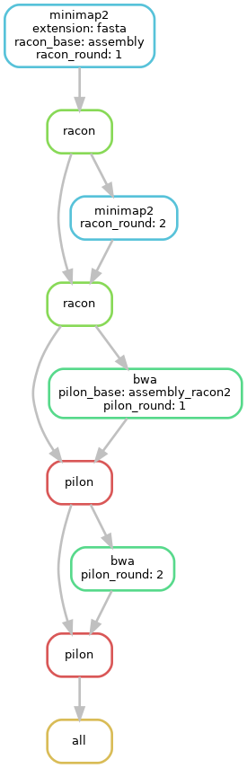

# Nanopore-snake

#### Description

**Currently untested**

Nanopore-snake is a small snakemake pipeline to polish a Nanopore long reads assembly with Racon and/or Pilon. This pipeline was designed and tested to run on the Vital-it computational platform, but it could be easily modified to run anywhere. Parameters are specified in *config.yaml* and should be self-explanatory.

Example of DAG for two rounds of Racon and two rounds of Pilon :



#### Running

The provided example configuration file expects the following directory structure :

```
.
├── config.yaml
├── data
│   ├── assembly.fasta
│   ├── illumina_reads_L001_R1.fastq.gz
│   ├── illumina_reads_L001_R2.fastq.gz
│   └── nanopore_reads_combined.fastq.gz
└── Snakefile
```

With this structure, the pipeline can be run simply with `snakemake` within the directory. After running the pipeline, the directory will look like this:

```
.
├── config.yaml
├── benchmarks
│   ├── assembly_fasta_bwa_round1.tsv
│   ├── assembly_fasta_bwa_round2.tsv
│   ├── assembly_fasta_minimap_round1.tsv
│   ├── assembly_fasta_minimap_round2.tsv
│   ├── assembly_fasta_pilon_round1.tsv
│   ├── assembly_fasta_pilon_round2.tsv
│   ├── assembly_fasta_racon_round1.tsv
│   └── assembly_fasta_racon_round2.tsv
├── data
│   ├── assembly.fasta
│   ├── illumina_reads_L001_R1.fastq.gz
│   ├── illumina_reads_L001_R2.fastq.gz
│   └── nanopore_reads_combined.fastq.gz
├── logs
│   ├── assembly_fasta_bwa_round1.txt
│   ├── assembly_fasta_bwa_round2.txt
│   ├── assembly_fasta_minimap_round1.txt
│   ├── assembly_fasta_minimap_round2.txt
│   ├── assembly_fasta_pilon_round1.txt
│   ├── assembly_fasta_pilon_round2.txt
│   ├── assembly_fasta_racon_round1.txt
│   └── assembly_fasta_racon_round2.txt
├── output
│   ├── assembly_racon1.fasta
│   ├── assembly_racon2.fasta
│   ├── assembly_racon2_pilon1.fasta
│   └── assembly_racon2_pilon2.fasta
└── Snakefile
```

Intermediate assembly files are saved so that improvements for each step can be estimated.

#### TODO

- Implement option to run with conda
